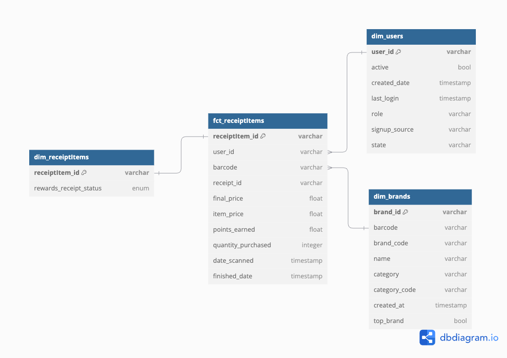
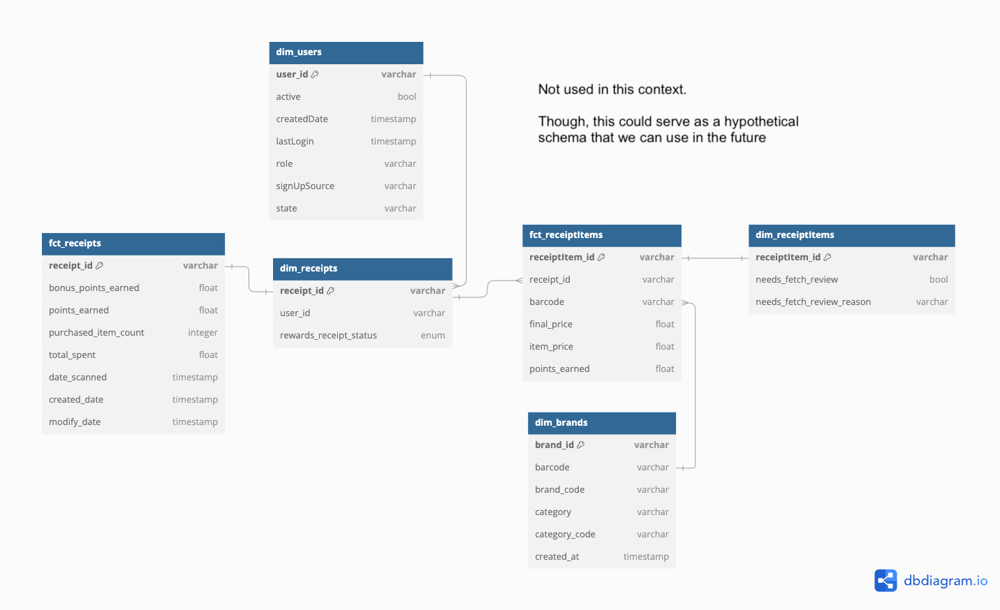

## Fetch Analytics Engineering Take-Home Assessment

### 0. Initial Assumptions 

It's important to set several assumptions to scope down the problem and to somewhat set the baseline of what we're working with moving forward. This serves as the guide to design our relational data warehouse design.

1. I will only consider bringing some features that are asked within the scope of the business problems. For example, if a feature A from `receipts` object serves no purpose in this context, then I am not going to ingest it to the data warehouse despite in a real production setting, it's always better to capture as many information as we can.
2. We're going to set `barcode` as the join key between `receiptItems` and `brands` 
3. Within the context of the business questions, `pointsEarned` is not the main KPI we're interested in analyzing, instead `finalPrice` and `totalSpent` are.
4. I'm not fully familiar with how the backend system works, especially within the receipt scanner sector. Therefore, the following design and analyses are done based on my best heuristic guesses.

These assumptions are direct results of EDA on these files (addressed in Part 3)

### 1. Relational Data Warehouse Design

1. All of the objects (files) are unstructured as one instance of each object could differ structurally and quantitatively from one to another.
2. The unstructured nature of the `receipts` object is further amplified by the existence of `rewardsReceiptItemList` which can contain arbitrary amount of both related and unrelated attributes which I assume depend on the brand / partner of the item that is scanned in the receipt.
3. Despite the clutter, there's still a shared pattern that we can capture and load to a centralized data warehouse where further analytics can be operated on. To follow industry's standards, let's use **Kimball's technique (star schema)** to design the architecture of our data warehouse.
4. This is where another challenge surface onto the picture. According to Kimball's rules, it's always the best practice to only have one **fact** table to contain all the quantitative related fields and features. In our case, we have two objects (`receipts` and `receiptItems`) that have a one-to-many relationship with both containing related quantitative values. This raises the question of what level of granularity that we want to center our data modeling at. Let's discuss these two different options:
    1. Considering the business questions that had been raised by stakeholders. I would like to propose setting the granularity at the `receiptItems` level and ultimately creating only one fact table.
    
    

    We can see that `receipts` object has completely been transformed and pivoted to `receiptItems`, which means that we will be replicating `receipts` level attributes throughout corresponding `receiptItems` entities. Moreover, I attached `receipt_id` as a degenerate dimension to allow us to query `receiptItems` on a `receipts` level perspective.

    Basing our decisions on the above diagram, some tradeoffs:
    (+) Improve analytical performance as we require less joins as there's only one table that grows significantly faster (fact table), instead of having two fact tables that can scale infinitely.
    (+) There's only one source of truth in terms of quantitative measures. This makes analytical operations much more one-dimensional as all business problems can be centered around `receiptItems` instead of two different objects.
    (-) The replication of `receipts` level values across correlated `receiptItems` can increase redundancy and space complexity.
    (-) If schema changes or `receipts` level features grow signifcantly, it'll be much more interpretable and scalable if we separate `receipts` and `receiptItems` to their own respective fact tables.

    2. Two fact tables design. Here, instead of combining `receipts` into `receiptItems`, we have two separate fact tables for each (`fct_receipts` and `fct_receiptItems`) with `dim_receipts` as the connector. The reason why we have `dim_receipts` as connector is to still abide to Kimball's design rule of never connecting two fact tables directly.

    

    Several tradeoffs from this design:
    (+) More flexibility in storing data as system grows.
    (+) More normalized that'll increase query performance though at the end of the day, denormalized tables are accepted in OLAP design.
    (-) If joins are required to combine both fact tables, it could slow down analytical performance.
    (-) Data inconsistencies could arise as some quantitative measures from the `receiptItems` level could be present in `receipts` level of granularity also. For example, there exists `points_earned` in `receiptItems` when there's already the aggregated `points_earned` in the `receipts` table. 

5. After breaking down differences and tradeoffs between the two options, I'd like to go with the first option as it's sufficient enough to answer all questions that were given by the business stakeholders.
6. To simulate this data warehouse, I have pushed a `Dockerfile` and `docker-compose.yml` to this repository for you to reproduce the OLAP ecosystem which allows querying using SQL. Instructions to reproduce:

First, clone this repository and go to the root directory of this project. Make sure `Docker` is running and then run:

```{bash}
docker-compose build
docker-compose up
```

These will spin up a `PostgreSQL` container in which the data has been populated using `init.sql` DDL script and `load_data.py` DML script. They may be missing some industry-standard operations, but that's not the highlight of this assessment, therefore, I coded the bare minimum to get the OLAP experience working. 

After the container is running, feel free to connect it your go-to SQL IDE. In this case, I'll show you how you can run SQL directly inside the `Docker` container.

Run `docker ps ` and retrieve the container ID

```{bash}
docker exec -it {CONTAINER_ID} psql -U admin -d olap
```

Then, feel free to run any SQL queries of your own creation or the ones that are stored in the `sql/` folder.

### 2. SQL Queries to Answer Business Problems

SQL queries have been made and stored in the `sql/` folder. Each file corresponds to one answer.

### 3. Data Quality Issues

Most of data quality issues are addressed in two ways:

1. Through Python Jupyer notebook EDA (check `./eda.ipynb` file)
2. Through heuristic observation

#### Data quality issues addressed in Python

More details are explained in the notebook, but these is the summary:

1. No join keys between `receiptItem`, `receipt`, and `brand`. Therefore, `barcode` is the most feasible way to connect between `receiptItem` and `brand` objects.
2. With `barcode` being the join key, there are more than half of the `receiptItems` that don't have `barcode` attribute.
3. Considering spending is one of the primary KPIs we're interested in studying, we use `finalPrice` as the main measure to quantify this objective. Moreover, since we're setting `receiptItem` to be the level of granularity in our OLAP, therefore we're not going to use `receipt` level `totalSpent` attribute. 
4. There are only 174 `receiptItems` that don't have `finalPrice` measure, which needs to be addressed in the long run.
5. Considering the removal of `totalSpent`, there are only 55 `receipts` that have the aggregated `finalPrice` doesn't add up to the `totalSpent`.
6. `pointsEarned` is a problematic measure as it doesn't show up in 6014 `receiptItems`. We have to resort to `pointsEarned` attribute in the `receiptLevel` if we want to analyze this metric.
7. The overall structure of how these files are captured. I assume it's scraped from NoSQL databases, which explains the messiness of the data.

#### Extra findings through heuristic observation

1. The `cpg` attribute in the `brands` is somehow connected to `rewardsGroupPartnerId`, leading me to believe it's important to attach these values to the OLAP in the real production setting.
2. The amount of `needsFetchReview` and `needsFetchReviewReason` attributes are the same.
3. There are mistyped or mistranscribed texts in the receipt. 
4. There are receipts with `totalSpent` of $1 and still got approved.
5. There is a lot of `receiptItems` with `barcode` not following the general format.

### 4. Communicate with Stakeholders

Answers are in `./communication.txt`

### 5. Next Steps (Hypothetically)

1. Set clearer DDL, constraints, and data warehouse schema.
2. Understand how Fetch' backend systems generate the data.
3. Set up nightly ETL batch jobs to update and refresh data in the warehouse.
4. Connect to analytics platforms for visualizations.
5. Circle back with business and dev teams to solve their respective pain points.
